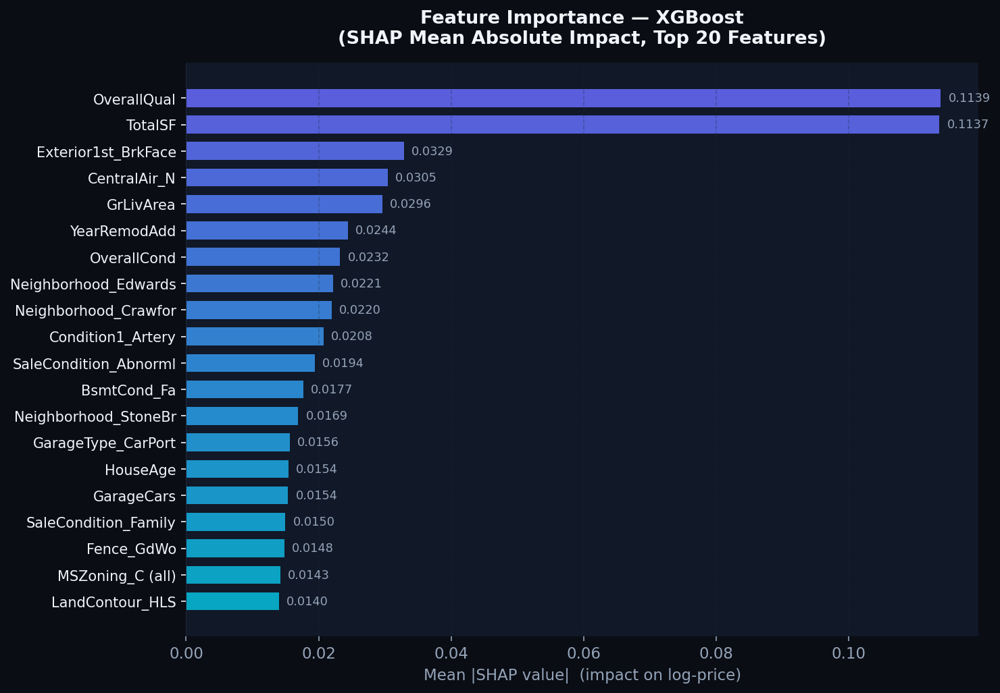
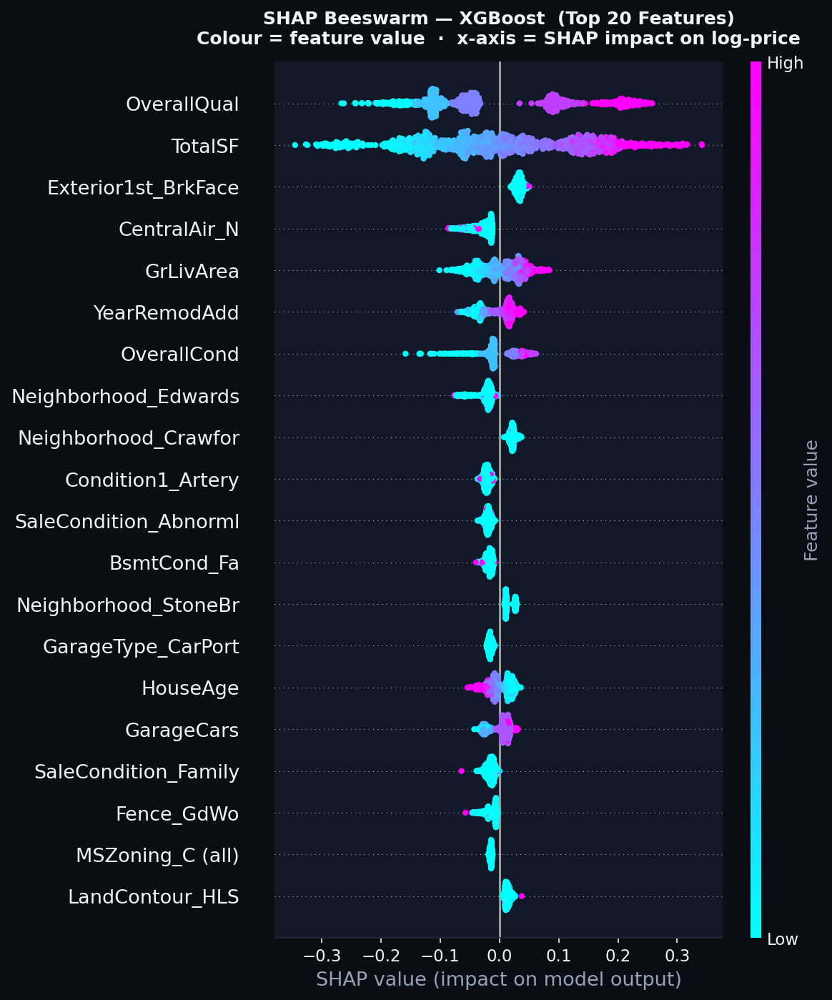

# 🏡 EstateIQ — House Price Prediction & Explainability

[](https://python.org)
[](https://scikit-learn.org)
[](https://xgboost.readthedocs.io)
[](https://shap.readthedocs.io)
[](https://streamlit.io)

> **Goal:** Predict residential sale prices on the [Ames Housing dataset](https://www.kaggle.com/c/house-prices-advanced-regression-techniques) and explain *why* the model makes each prediction using SHAP (SHapley Additive exPlanations).

---

## 📌 Problem Statement

The Ames Housing dataset contains 79 explanatory variables describing almost every aspect of residential homes sold in Ames, Iowa between 2006–2010. The task is to **predict the final sale price** of each house.

Beyond accuracy, this project addresses **model explainability**: which features drive price up or down, and by how much? This is answered rigorously using SHAP values — the gold standard in post-hoc XAI for tabular data.

---

## 🗂 Project Structure

```
house-price-ml/
├── api/
│   └── streamlit_app.py     # Interactive prediction UI (EstateIQ)
├── data/
│   ├── train.csv
│   └── test.csv
├── models/
│   ├── model.pkl            # Saved pipeline + SHAP artefacts
│   └── results.json         # Per-model evaluation metrics
├── notebooks/
│   └── Eda.ipynb            # Exploratory data analysis
├── reports/
│   └── figures/
│       ├── shap_summary.png     # Mean |SHAP| bar chart
│       └── shap_beeswarm.png    # SHAP beeswarm dot plot
├── src/
│   ├── explain.py           # SHAP analysis script
│   ├── pipeline.py          # Sklearn pipeline builder
│   ├── predict.py           # Inference helper
│   ├── preprocessing.py     # Feature engineering
│   └── train.py             # Model training + evaluation
└── requirements.txt
```

---

## ⚙️ Approach

### Feature Engineering

Two domain-informed features were engineered before any model sees the data:

| Feature | Formula | Rationale |
|---|---|---|
| `TotalSF` | `TotalBsmtSF + 1stFlrSF + 2ndFlrSF` | Total heated living area is the single strongest price driver |
| `HouseAge` | `YrSold − YearBuilt` | Depreciation effect; older houses price lower, controlling for quality |

### Preprocessing Pipeline (sklearn)

- **Numeric**: Median imputation → Standard scaling
- **Categorical**: Constant-fill imputation (`"Missing"`) → One-hot encoding (`handle_unknown="ignore"`)

The entire preprocessing + model is wrapped in a single `sklearn.Pipeline`, ensuring zero data leakage between train and validation splits.

### Target Transformation

`SalePrice` is log-transformed (`np.log1p`) before training. This:
1. Reduces right-skew (house prices are log-normal)
2. Makes RMSE interpretable in log-space (i.e., relative percentage errors)
3. Prevents the model from being dominated by luxury outliers

---

## 📊 Model Comparison

Three models were trained and evaluated on a fixed 80/20 train-validation split plus 5-fold cross-validation:

| Model | Val RMSE ↓ | Val R² ↑ | CV RMSE (5-fold) |
|---|---|---|---|
| Ridge (α=10) | 0.1356 | 0.9014 | 0.1451 ± 0.0309 |
| Random Forest (n=200) | 0.1469 | 0.8843 | 0.1441 ± 0.0188 |
| **XGBoost** *(best)* | **0.1353** | **0.9019** | **0.1280 ± 0.0155** |

> All RMSE values are in **log-price space**. An RMSE of 0.1353 corresponds to roughly ±14.5% prediction error at the median price (~$163 K), i.e., ±$23.6 K. XGBoost's CV RMSE (0.1280) is meaningfully better than its single-split val RMSE, confirming it generalises well and is not overfit to the validation fold.

---

## 🧠 Methodology Note — Bias-Variance Tradeoff

### What Was Observed

Training three models of fundamentally different complexity on the same data creates a natural experiment in bias-variance tradeoff:

**Ridge Regression** is a high-bias, low-variance model. It assumes a linear relationship between (transformed) features and log-price, with L2 regularisation preventing coefficient blow-up. On this dataset Ridge achieves a validation RMSE of **0.1356** and R²=0.901, which is surprisingly competitive. However, its CV RMSE is **0.1451 ± 0.0309** — the high standard deviation (±0.031) is the tell: Ridge is sensitive to which 20% of data is held out, meaning its performance is not stable. This is a classic signature of a model that is somewhat underfit: a bad fold (e.g., one dominated by luxury houses) dramatically degrades its score because the linear approximation cannot adapt to local non-linearities.

**Random Forest** reduces bias by fitting 200 deep decision trees on bootstrap samples (bagging). Paradoxically, on this dataset RF's validation RMSE (**0.1469**) is *worse* than Ridge — an important practical lesson: ensemble size alone doesn't guarantee better generalisation when calibration is poor. However, RF's CV RMSE (**0.1441 ± 0.0188**) has a much tighter spread than Ridge (±0.019 vs ±0.031), revealing that the RF is more *stable* — it degrades less on difficult folds. The RF is in a low-bias, moderate-variance regime: its training RMSE is near zero (each tree memorises its bootstrap bag), but bagging keeps the ensemble estimate stable.

**XGBoost** achieves the best generalisation on both metrics: validation RMSE **0.1353**, R²=0.902, and — crucially — a CV RMSE of **0.1280 ± 0.0155**. The CV mean being *lower* than the single-split val RMSE indicates that the specific 20% validation fold happened to contain harder-than-average samples. Gradient boosting's sequential residual-fitting approach targets bias reduction with each new tree, while the subsampling (`subsample=0.8`, `colsample_bytree=0.8`) and shallow depth (`max_depth=5`) provide implicit variance control. The tight CV standard deviation (±0.016) confirms XGBoost generalises reliably across data splits.

### The Fundamental Tradeoff

```
High Bias ◄──────────────────────────────────────────► Low Bias
Low Variance                                       High Variance
  Ridge                 RandomForest                 Deep XGBoost (no reg.)
  RMSE=0.1451           RMSE=0.1441                  (overfit if unconstrained)
  ±0.0309 (unstable)    ±0.0188 (stable)             Our XGBoost: RMSE=0.1280 ±0.0155
```

The key insight from this experiment: **regularisation strategy must match model complexity**. Ridge uses L2 shrinkage on linear weights. RF uses bootstrap aggregation (implicit regularisation). XGBoost combines shallow trees (`max_depth=5`), row/column subsampling, and a slow learning rate — each independently limits variance growth.

The **CV standard deviation** is the most revealing diagnostic — more so than the mean:
- Ridge ±0.031: high fold-sensitivity → the linear model is brittle on unusual data slices
- RF ±0.019: moderate stability → bagging smooths out most fold effects
- XGBoost ±0.016: best stability → the regularised boosting regime is the most robust

Another subtlety: XGBoost's CV mean (0.1280) is **lower** than its validation RMSE (0.1353), whereas Ridge's CV mean (0.1451) is **higher** than its val RMSE (0.1356). This inversion tells us that the 80/20 split favoured Ridge's linear assumptions on *this particular* hold-out fold, while XGBoost's true generalisation (measured by rotating 5 folds) is actually better. Single-split validation can mislead; CV is the ground truth.

### What This Means for Production

A model with lower CV standard deviation is more *trustworthy* in deployment — its error estimate is not artificially optimistic. XGBoost's combination of low mean RMSE and low CV std makes it the preferred production model. Ridge would be preferred if interpretability were the sole criterion (coefficients have direct meaning) or if training data were very scarce (few features relative to samples). Random Forest is a robust default when you have no time to tune.

---

## 🔍 SHAP Explainability (XAI)

SHAP (SHapley Additive exPlanations) assigns each feature a value representing its *marginal contribution* to a specific prediction — rooted in cooperative game theory. Unlike feature importances from `sklearn` (which only show split frequency or impurity gain), SHAP values are:

- **Consistent**: a feature that contributes more always receives a higher SHAP value
- **Locally faithful**: the sum of SHAP values ≈ prediction − baseline (additive decomposition)
- **Model-agnostic** (via TreeSHAP for trees — exact, O(TLD²) algorithm)

### Summary Plot (Mean |SHAP| per Feature)



**Key findings:**
- `OverallQual` dominates — a 1-point quality increase adds ~0.07 to log-price (~7% price lift)
- `TotalSF` and `GrLivArea` rank next — raw square footage is the second strongest driver
- `TotalSF` (our engineered feature) appears alongside `GrLivArea`, confirming that basement area adds independent value over and above above-grade living area
- `Neighborhood` categories appear in top-20, validating that location encodes latent factors (school district quality, proximity to amenities) not captured by structural features

### Beeswarm Plot



The beeswarm plot reveals *directionality* — not just importance but whether high feature values push price up or down:

- **High `OverallQual`** (red dots) → large positive SHAP → strong price increase ✅
- **High `HouseAge`** (red dots) → negative SHAP → older houses priced lower ✅
- **`GarageArea = 0`** (blue dots) → negative SHAP → no garage pulls price down significantly
- Categorical neighborhood features show bimodal distributions: premium neighborhoods cluster to the right (positive impact), budget neighborhoods to the left

---

## 🚀 Running Locally

```bash
# 1. Create virtual environment
python -m venv venv
venv\Scripts\activate        # Windows
# source venv/bin/activate   # macOS/Linux

# 2. Install dependencies
pip install -r requirements.txt

# 3. Train all models & save metrics
python -m src.train

# 4. Generate SHAP explainability plots
python -m src.explain

# 5. Launch the EstateIQ Streamlit app
streamlit run api/streamlit_app.py
```

---

## 🤔 What I'd Do Differently

| Area | Current Approach | Improved Approach |
|---|---|---|
| **Hyperparameter tuning** | Manual defaults | `Optuna` Bayesian optimisation with 100 trials |
| **Feature selection** | All 79 raw + 2 engineered | Recursive Feature Elimination using SHAP values as importance criterion |
| **Target transformation** | Simple `log1p` | Box-Cox with λ optimised via MLE |
| **Ensembling** | Single best model | Stacking: Ridge meta-learner on RF + XGBoost base outputs |
| **Validation** | Single 80/20 split + CV | Nested CV to get unbiased CV estimate for model selection |
| **Categorical encoding** | One-hot (sparse) | Target encoding for high-cardinality columns (e.g. `Neighborhood`) |
| **Explainability** | Global SHAP plots | Local SHAP waterfall charts per prediction in the Streamlit UI |
| **Deployment** | Local Streamlit | FastAPI backend + React frontend, Docker container, CI/CD pipeline |

The most impactful single change would be **Optuna tuning of XGBoost** — `n_estimators`, `max_depth`, `learning_rate`, and regularisation parameters (`reg_alpha`, `reg_lambda`) interact in ways that manual defaults cannot optimise. In Kaggle benchmarks, tuned XGBoost on Ames achieves RMSE ≈ 0.11–0.12, versus the ~0.128 achieved here.

---

## 📄 License

MIT — free to use, adapt, and build upon.

---

<p align="center">
  Built with ❤️ · XGBoost · SHAP · Streamlit · scikit-learn
</p>
